# 🌾 eAgri — Smart Farming Solutions

<p align="center">
  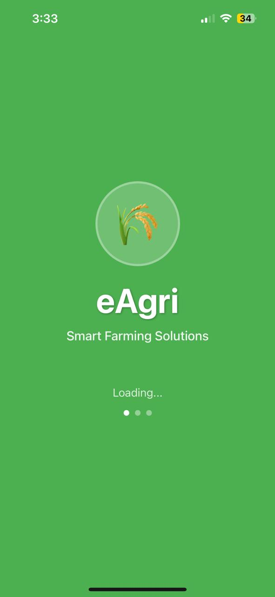
</p>

<p align="center">
  A <b>React Native</b> mobile application that empowers farmers with real-time crop monitoring, a product marketplace, equipment rentals, weather forecasts, and a farming community — all in one platform.
</p>

<p align="center">
  
  
  
  
  
  
</p>

---

## 📖 Table of Contents

- [Tech Stack](#-tech-stack)
- [Onboarding & Auth](#-onboarding--authentication)
- [Home Dashboard](#-home-dashboard)
- [Weather Forecast](#-weather-forecast)
- [Marketplace](#-marketplace)
- [Cart & Checkout](#-cart--checkout)
- [Payment](#-secure-payment)
- [Equipment Rental](#-equipment-rental)
- [Community & Messages](#-community--messages)
- [Profile](#-profile-menu)
- [Setup](#-setup)

---

## 🛠️ Tech Stack

| Layer | Technology | Purpose |
|---|---|---|
| Mobile | React Native | Cross-platform iOS & Android app |
| Backend | Node.js + Express | REST API server |
| Database | MongoDB + Mongoose | Stores users, products, orders, rentals, posts |
| Auth | Firebase Auth | Email/password login & Google OAuth |
| Media Storage | Cloudinary | Product images, community post photos |
| Push Notifications | Firebase Cloud Messaging | Order updates, rental alerts |
| Payment | SSLCommerz | Secure online transactions |
| Weather | OpenWeatherMap API | Real-time weather & forecast data |

---

## 🚀 Onboarding & Authentication

When the app launches, users go through a brief onboarding that highlights key features before reaching the login screen. Authentication is handled by **Firebase Auth**, supporting both email/password and Google sign-in. User profile data is stored in **MongoDB** after the first login.

<p align="center">
  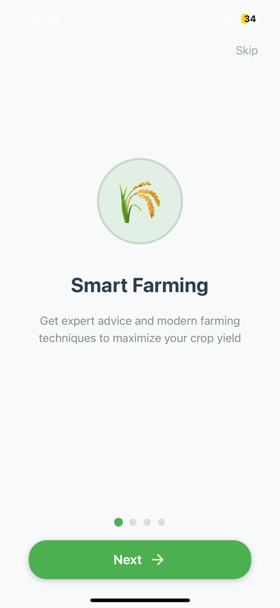
  &nbsp;&nbsp;
  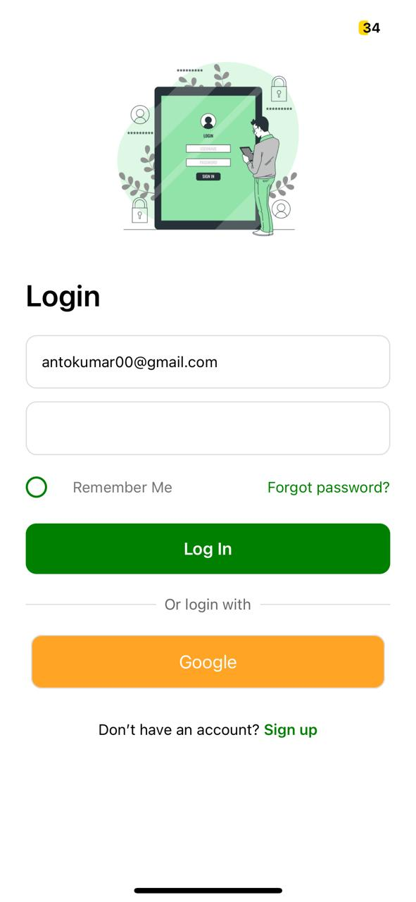
</p>

- Onboarding slides introduce Smart Farming, Marketplace, Rentals, and Community features
- Google OAuth enables one-tap sign-in
- "Remember Me" persists the session using Firebase token refresh
- New users can register directly from the login screen

---

## 🏠 Home Dashboard

The dashboard is the central hub of eAgri. It pulls live weather data from the **OpenWeatherMap API** and displays farm stats fetched from **MongoDB** — giving farmers an instant overview of their farm's health.

<p align="center">
  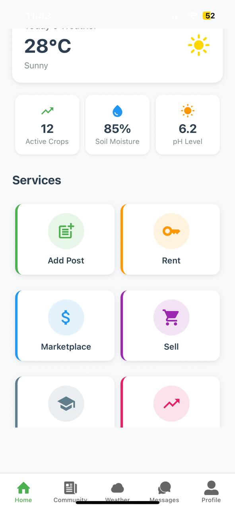
</p>

- **Active Crops** — total crops currently being tracked
- **Soil Moisture** — live sensor reading (e.g., 85%)
- **pH Level** — current soil pH value (e.g., 6.2)
- **Services Grid** — quick navigation to Add Post, Rent, Marketplace, Sell, Learn, and Analytics

---

## 🌤️ Weather Forecast

Farmers can search any city and instantly get current weather conditions plus a 4-day temperature trend. Data is fetched from the **OpenWeatherMap API** and rendered as a bar chart for easy planning.

<p align="center">
  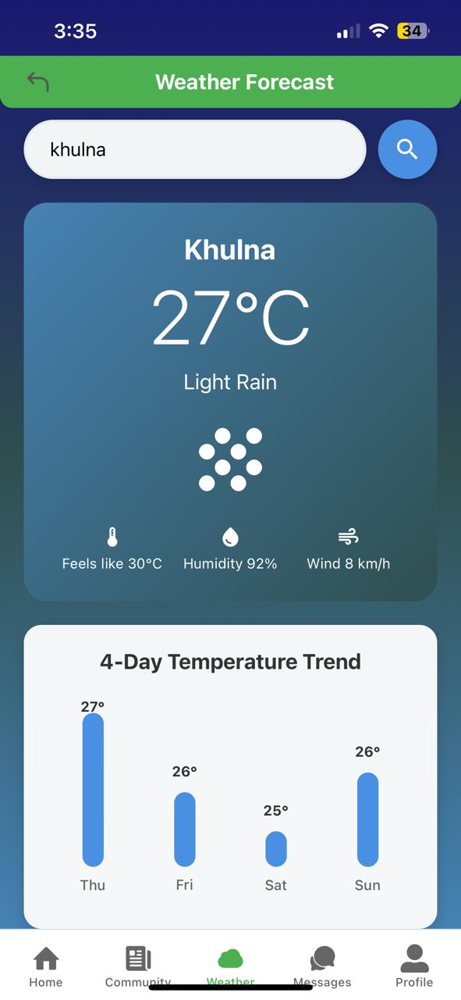
</p>

- Current temperature, condition, feels-like, humidity, and wind speed
- 4-day forecast trend to plan irrigation, harvesting, or spraying schedules
- City search with instant results

---

## 🛒 Marketplace

The marketplace lets farmers buy and sell Seeds, Fertilizers, Pesticides, Tools, and more. Product listings and seller data are stored in **MongoDB**, while product images are hosted on **Cloudinary** for fast, optimized delivery.

<p align="center">
  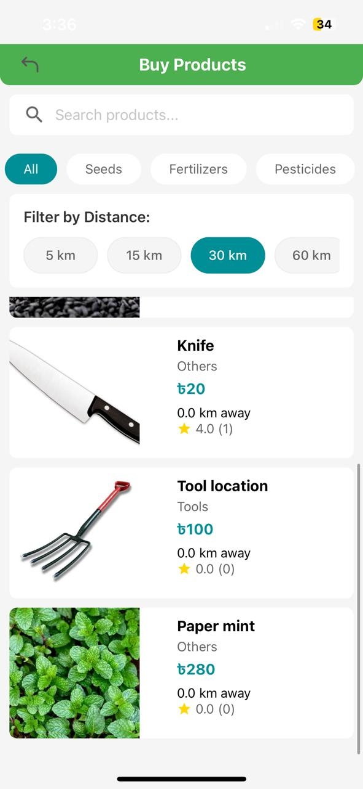
  &nbsp;&nbsp;
  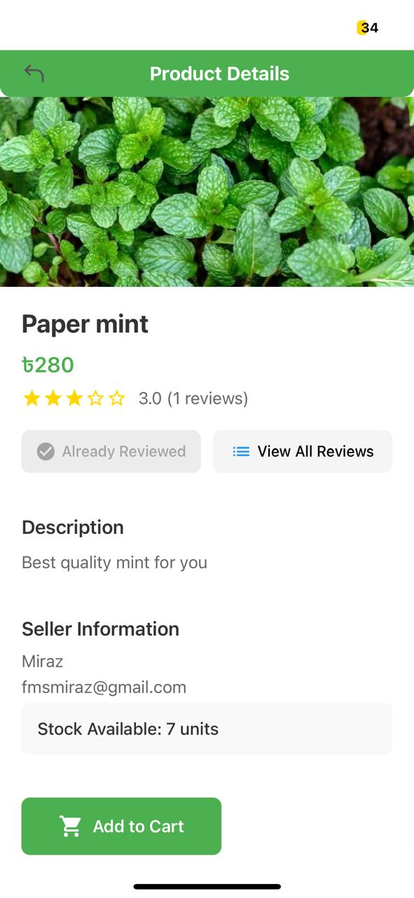
</p>

- Filter products by **category** (Seeds, Fertilizers, Pesticides, Tools, Others)
- Filter by **distance** — 5 km, 15 km, 30 km, or 60 km from the user's location
- Product detail page shows image (via Cloudinary), price, description, star rating, reviews, seller name, email, and available stock
- "Already Reviewed" badge prevents duplicate reviews

---

## 🛍️ Cart & Checkout

Users can add multiple products to their cart, adjust quantities, remove items, and see a live total before proceeding to payment. Cart state is managed locally in the app and synced to **MongoDB** on checkout.

<p align="center">
  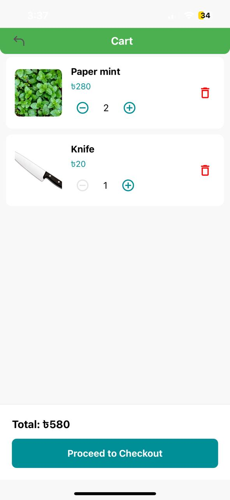
</p>

- Increase/decrease quantity with `+` / `−` controls
- Remove individual items with the delete button
- Live total calculation updates instantly
- "Proceed to Checkout" triggers the SSLCommerz payment flow

---

## 💳 Secure Payment

Payments are processed through **SSLCommerz**, a widely-used payment gateway in Bangladesh. It supports all major mobile banking services and cards, secured with SSL encryption. Order records are saved in **MongoDB** upon payment confirmation.

<p align="center">
  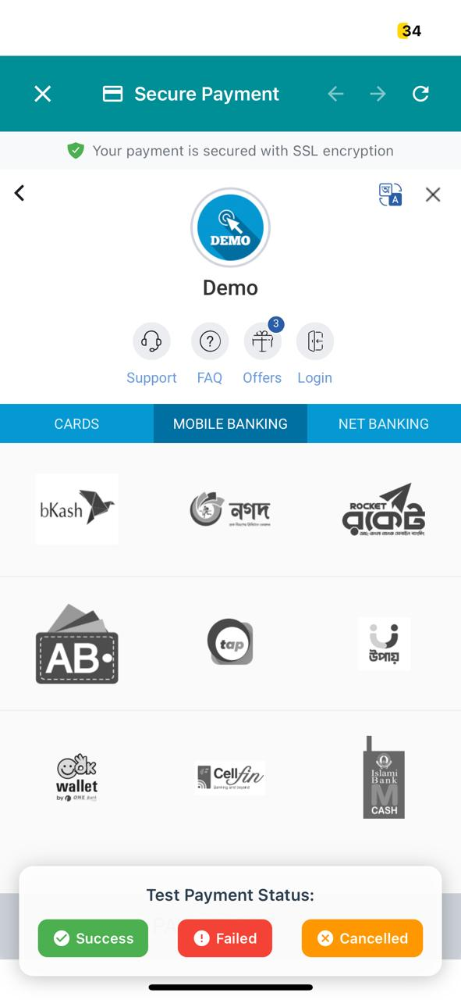
  &nbsp;&nbsp;
  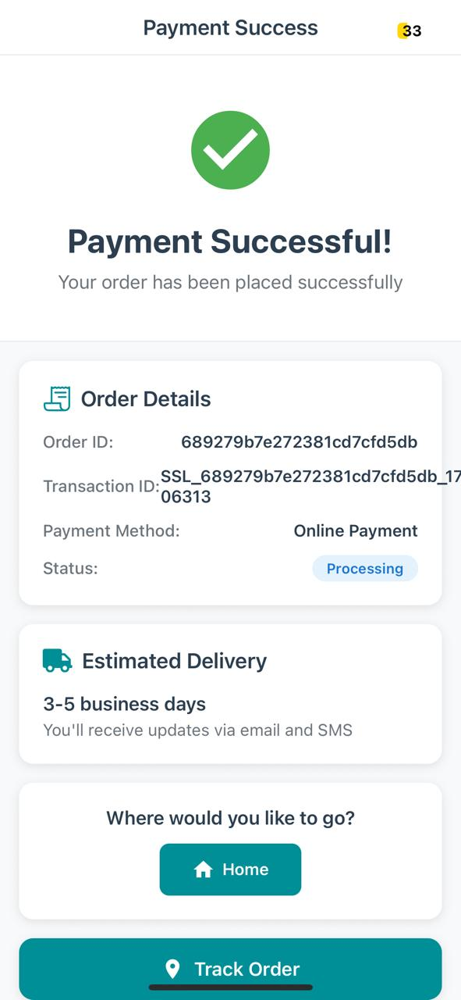
</p>

**Supported payment methods:**
- Mobile Banking: bKash, Nagad, Rocket, Upay, OKWallet, CelFin, Islami Bank MCash
- Cards & Net Banking also available

After a successful payment, users see their **Order ID**, **Transaction ID**, payment method, status, estimated delivery (3–5 business days), and options to go Home or Track Order.

---

## 🔑 Equipment Rental

Farmers can rent tools and equipment by the day without purchasing them outright. Rental records — including status, payment info, and dates — are stored in **MongoDB**.

<p align="center">
  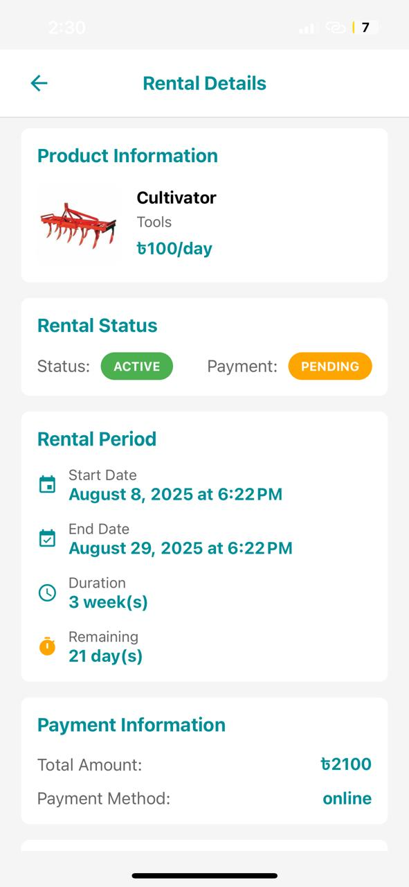
</p>

- Displays product info: name, category, and daily rate (e.g., Cultivator at ৳100/day)
- **Rental Status** badge: Active / Inactive
- **Payment Status** badge: Pending / Paid
- Full rental period: start date, end date, duration in weeks, and remaining days
- Total cost and payment method shown in the Payment Information section

---

## 🤝 Community & Messages

The community feed allows farmers to share updates, photos, and knowledge with each other. Post images are uploaded to **Cloudinary** and post metadata (author, likes, comments) is stored in **MongoDB**. Real-time messaging uses **Firebase Firestore**.

<p align="center">
  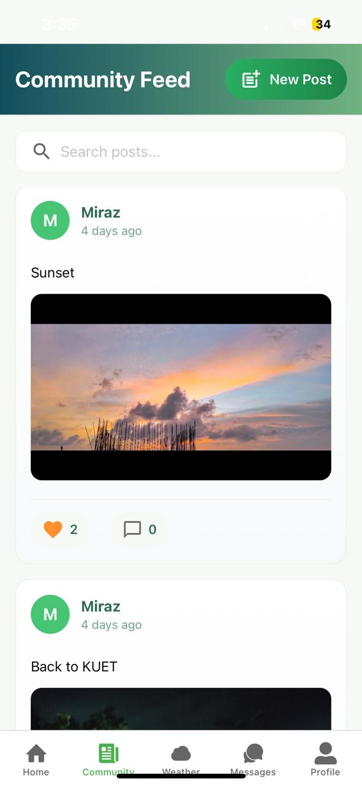
  &nbsp;&nbsp;
  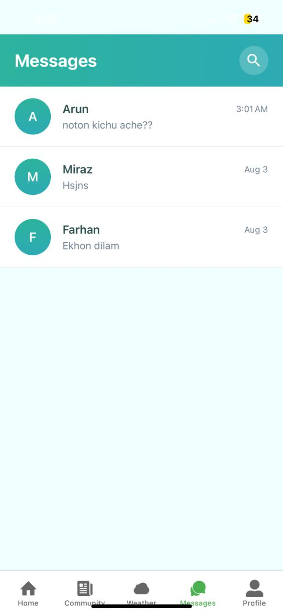
</p>

- Community feed with image posts, like counts, and comment counts
- Search posts by keyword
- "New Post" button to create and publish a post with a photo (uploaded via Cloudinary)
- Direct messaging list with contact name, message preview, and timestamp
- Search conversations from the Messages screen

---

## 👤 Profile Menu

A slide-out menu from the Profile tab provides access to all account management features. Data is fetched from **MongoDB** based on the logged-in Firebase user.

<p align="center">
  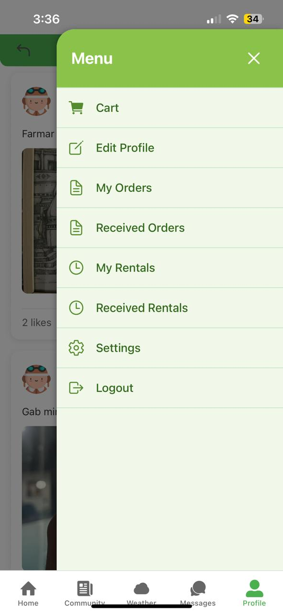
</p>

- **Cart** — view and manage saved items
- **Edit Profile** — update name, photo, and contact info
- **My Orders / Received Orders** — track purchases and sales
- **My Rentals / Received Rentals** — manage rental activity
- **Settings** — app preferences
- **Logout** — signs out via Firebase Auth

---

## ⚙️ Setup

### Prerequisites
- Node.js >= 16.x
- React Native CLI
- Android Studio / Xcode
- MongoDB Atlas account
- Firebase project
- Cloudinary account
- SSLCommerz merchant account

### Installation

```bash
git clone https://github.com/your-username/eagri.git
cd eagri
npm install
```

### Environment Variables

Create a `.env` file in the root:

```env
# MongoDB
MONGO_URI=mongodb+srv://your_cluster_url

# Firebase
FIREBASE_API_KEY=your_key
FIREBASE_PROJECT_ID=your_project_id

# Cloudinary
CLOUDINARY_CLOUD_NAME=your_cloud_name
CLOUDINARY_API_KEY=your_api_key
CLOUDINARY_API_SECRET=your_api_secret

# Payment
SSLCOMMERZ_STORE_ID=your_store_id
SSLCOMMERZ_STORE_PASS=your_store_password

# Weather
WEATHER_API_KEY=your_openweathermap_key
```

### Run the App

```bash
# Start Metro bundler
npx react-native start

# Run on Android
npx react-native run-android

# Run on iOS
npx react-native run-ios
```

---

## 📄 License

MIT © eAgri Team — *Made with ❤️ for farmers everywhere*